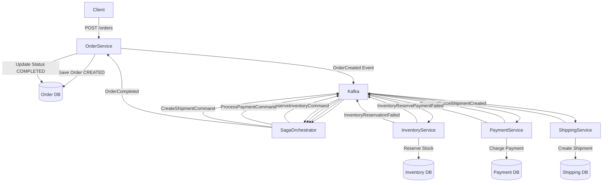
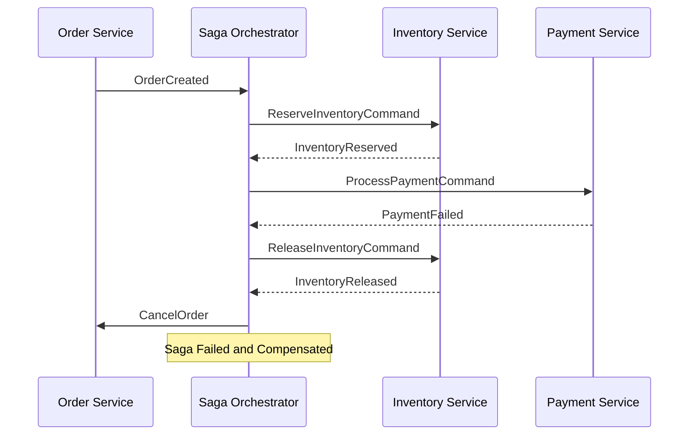
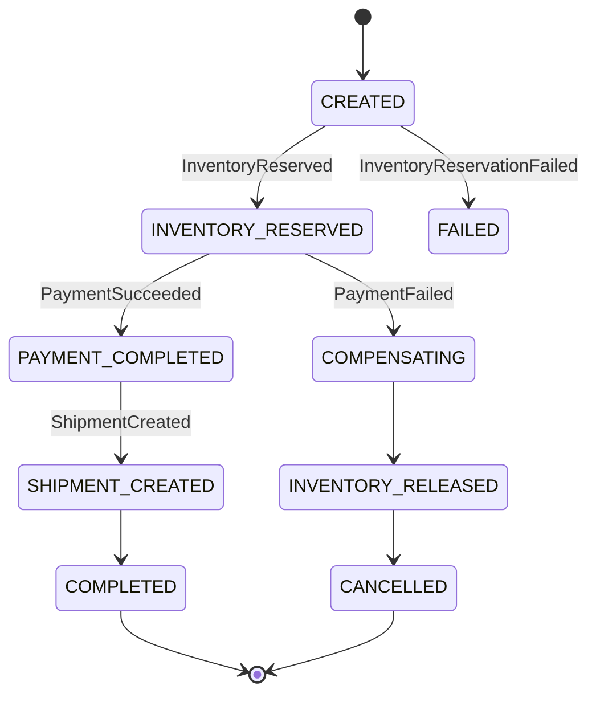

# order-saga

HLD:

```mermaid
flowchart TD

    Client[Client]

    Client -->|POST /orders| OrderService

    OrderService -->|Save Order CREATED| OrderDB[(Order DB)]
    OrderService -->|OrderCreated Event| Kafka

    Kafka --> SagaOrchestrator

    SagaOrchestrator -->|ReserveInventoryCommand| Kafka

    Kafka --> InventoryService

    InventoryService -->|Reserve Stock| InventoryDB[(Inventory DB)]

    InventoryService -->|InventoryReserved| Kafka
    InventoryService -->|InventoryReservationFailed| Kafka

    Kafka --> SagaOrchestrator

    SagaOrchestrator -->|ProcessPaymentCommand| Kafka

    Kafka --> PaymentService

    PaymentService -->|Charge Payment| PaymentDB[(Payment DB)]

    PaymentService -->|PaymentSucceeded| Kafka
    PaymentService -->|PaymentFailed| Kafka

    Kafka --> SagaOrchestrator

    SagaOrchestrator -->|CreateShipmentCommand| Kafka

    Kafka --> ShippingService

    ShippingService -->|Create Shipment| ShippingDB[(Shipping DB)]

    ShippingService -->|ShipmentCreated| Kafka

    Kafka --> SagaOrchestrator

    SagaOrchestrator -->|OrderCompleted| OrderService

    OrderService -->|Update Status COMPLETED| OrderDB
```

#Payment Failure Compensation

```mermaid
sequenceDiagram

    participant O as Order Service
    participant S as Saga Orchestrator
    participant I as Inventory Service
    participant P as Payment Service

    O->>S: OrderCreated

    S->>I: ReserveInventoryCommand
    I-->>S: InventoryReserved

    S->>P: ProcessPaymentCommand
    P-->>S: PaymentFailed

    S->>I: ReleaseInventoryCommand
    I-->>S: InventoryReleased

    S->>O: CancelOrder

    Note over S: Saga Failed and Compensated
```

#Saga Stage machine

```mermaid
  stateDiagram-v2

    [*] --> CREATED

    CREATED --> INVENTORY_RESERVED : InventoryReserved

    CREATED --> FAILED : InventoryReservationFailed

    INVENTORY_RESERVED --> PAYMENT_COMPLETED : PaymentSucceeded

    INVENTORY_RESERVED --> COMPENSATING : PaymentFailed

    PAYMENT_COMPLETED --> SHIPMENT_CREATED : ShipmentCreated

    SHIPMENT_CREATED --> COMPLETED

    COMPENSATING --> INVENTORY_RELEASED

    INVENTORY_RELEASED --> CANCELLED

    COMPLETED --> [*]

    CANCELLED --> [*]
```
  
